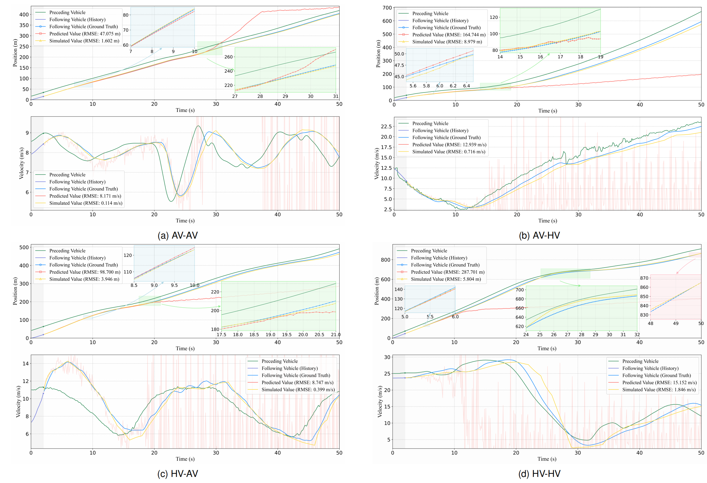

# PreSimNet

Official code for **PreSimNet: A Synergistic Physics-Encoded Deep Learning Framework for Integrated Prediction and Simulation of Car-Following in Mixed-Autonomy Traffic**.

PreSimNet models heterogeneous car-following interactions in mixed-autonomy traffic by coupling short-term trajectory prediction with closed-loop physics-guided behavior simulation. The model learns type-guided features for four interaction settings: `AV-AV`, `AV-HV`, `HV-AV`, and `HV-HV`.


## Overview

PreSimNet uses a shared trajectory encoder to extract temporal features and infer the car-following interaction type. The shared representation feeds two complementary heads:

- **Open-loop prediction**: directly forecasts future following-vehicle positions for short-term trajectory prediction.
- **Closed-loop simulation**: predicts parameters for physics-based car-following models and iteratively simulates future gap and velocity.
- **Type-guided MoE routing**: aggregates interaction-specific experts, with Top-2 routing support in the released main model.

## Repository Layout

- `model/model_MoE_gru_new.py`: main PreSimNet model.
- `model/model_*_baseline.py`: main baseline models used in the paper.
- `train_moe_top2.py`: PreSimNet training entry point.
- `train_baseline.py`: baseline training entry point with `--model` selection.
- `evaluate_baseline.py`: baseline evaluation entry point.
- `analyze_routing_topk.py`: Top-2 routing analysis using the original batch-wise evaluation protocol.
- `evaluate_position_rmse.py`: direct position RMSE evaluation.
- `loader2.py`: NumPy dataset loader and data schema.
- `data/sample/test_data_sample.npy`: small example file for format checks.
- `docs/figures/article/`: figures converted from the manuscript figure directory.

## Results

The following tables summarize the paper-level metrics.

### Trajectory Prediction And Type Classification

| Model | Position RMSE (m) | Classification Accuracy (%) | #Params | Inference Time (ms/batch) |
|---|---:|---:|---:|---:|
| Seq2Seq | 0.304 | 97.12 | 185,413 | 2.4 |
| Transformer | 0.295 | 98.62 | 246,085 | 2.9 |
| CS-LSTM | 0.380 | 95.68 | 247,525 | 4.9 |
| STDAN | 0.278 | 97.10 | 336,165 | 6.3 |
| BAT | 0.272 | 98.39 | 417,605 | 5.1 |
| HLTP | 0.280 | 98.96 | 527,882 | 7.4 |
| **PreSimNet** | **0.258** | **99.23** | **247,621** | **2.7** |

### Behavior Simulation

| Model | Velocity RMSE (m/s) | Gap RMSE (m) |
|---|---:|---:|
| Personalized IDM | 0.359 | 1.352 |
| PIDL-IDM (Joint) | 1.126 | 1.085 |
| PILSTM-IDM (Joint) | 0.606 | 0.776 |
| PIT-IDM (Joint) | 0.855 | 0.677 |
| **PreSimNet** | **0.342** | **0.420** |



More manuscript figures are available in [docs/figures/article](docs/figures/article).

## Data Format

Input files are NumPy arrays with shape `(N, 40, 13)`. Each sample contains 20 historical steps and 20 prediction steps.

| Index | Meaning |
|---:|---|
| 0 | dataset id |
| 1 | trajectory id |
| 2 | timestamp |
| 3 | car-following interaction type |
| 4 | lead vehicle velocity |
| 5 | lead vehicle acceleration |
| 6 | following vehicle velocity |
| 7 | following vehicle acceleration |
| 8 | gap |
| 9 | headway |
| 10 | relative velocity |
| 11 | following vehicle position |
| 12 | lead vehicle position |

Interaction type ids are `0=AV-HV`, `1=AV-AV`, `2=HV-HV`, and `3=HV-AV`.

## Installation

Install a PyTorch build that matches your CUDA environment, then install the remaining dependencies:

```bash
pip install -r requirements.txt
```

## Smoke Test

```bash
python train_moe_top2.py \
  --train-data data/sample/test_data_sample.npy \
  --epochs 1 \
  --batch-size 16 \
  --max-batches 2 \
  --checkpoint-dir runs/sample/checkpoints \
  --result-dir runs/sample/results
```

## Training

Train PreSimNet:

```bash
python train_moe_top2.py \
  --train-data ../data/train_data.npy \
  --epochs 21 \
  --batch-size 512 \
  --num-workers 4 \
  --gamma 0.9
```

Train a baseline:

```bash
python train_baseline.py \
  --model hltp \
  --train-data ../data/train_data.npy \
  --test-data ../data/test_data.npy \
  --epochs 21 \
  --batch-size 512
```

Available baseline names are `seq2seq`, `transformer`, `cslstm`, `stdan`, `bat`, and `hltp`.

## Evaluation

The evaluation scripts default to the paper's original batch-wise RMSE protocol with `batch_size=512` and `drop_last=True`.

Top-2 routing analysis:

```bash
python analyze_routing_topk.py \
  --checkpoint checkpoints/presimnet_top2/epoch21_e.tar \
  --data ../data/test_data.npy \
  --out-dir outputs/routing_top2
```

Direct position RMSE:

```bash
python evaluate_position_rmse.py \
  --data ../data/test_data.npy \
  --out outputs/position_rmse.csv
```

Baseline evaluation:

```bash
python evaluate_baseline.py \
  --model hltp \
  --checkpoint checkpoints/hltp_baseline/baseline_epoch21.tar \
  --data ../data/test_data.npy \
  --out outputs/hltp_baseline_test.csv
```
