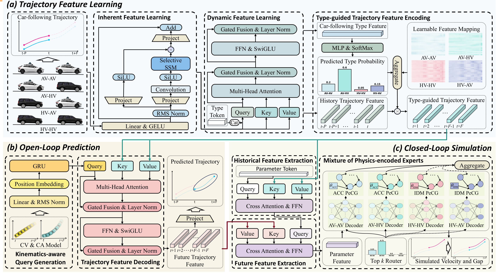
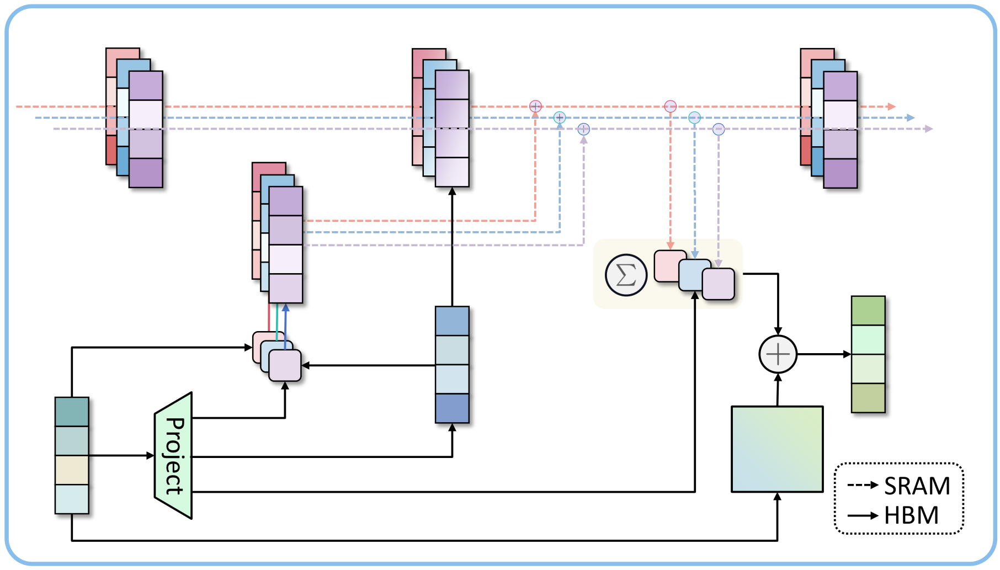
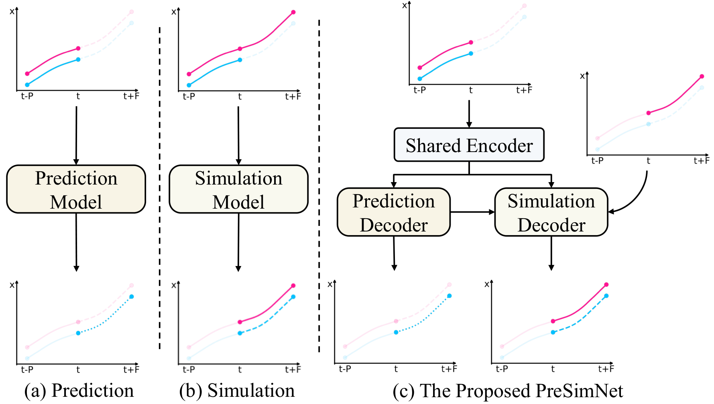
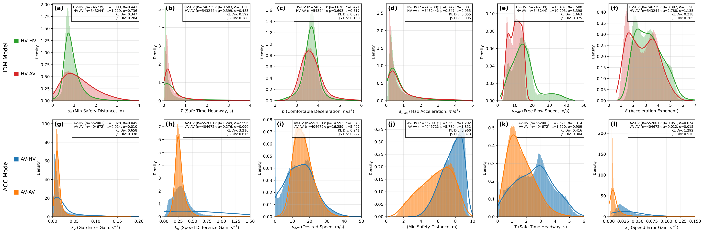
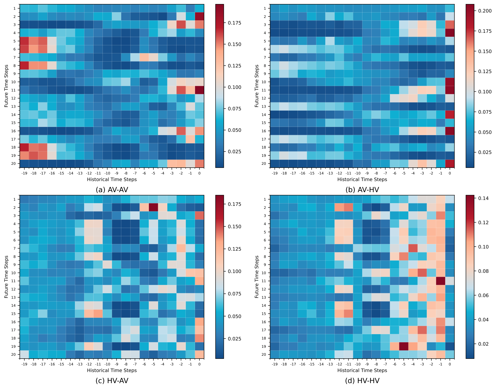
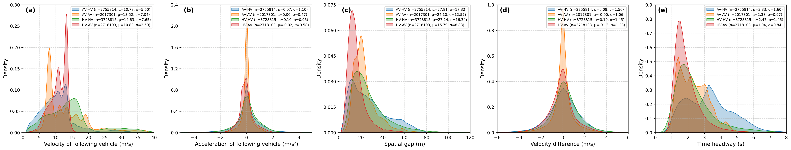
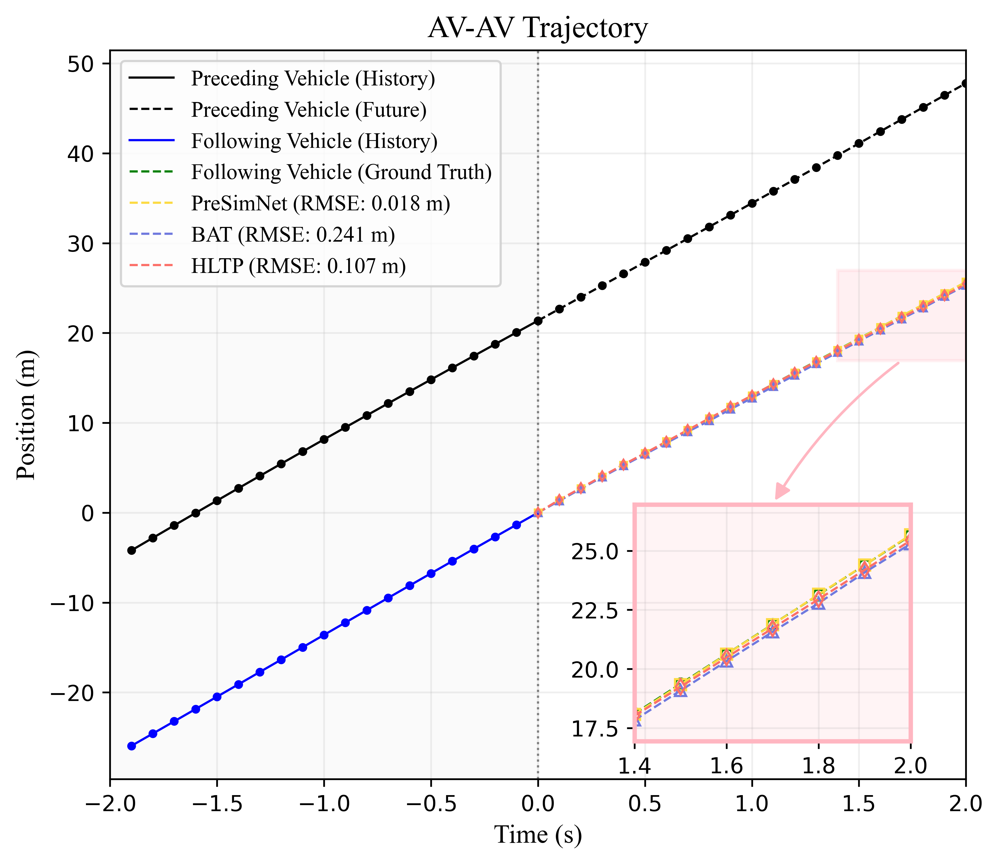
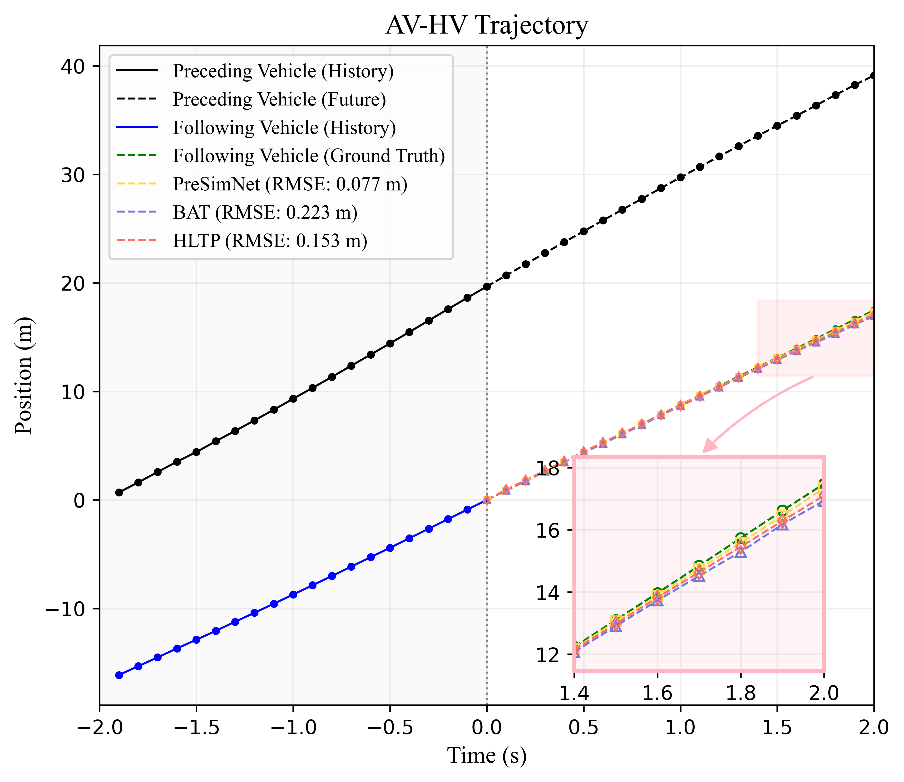
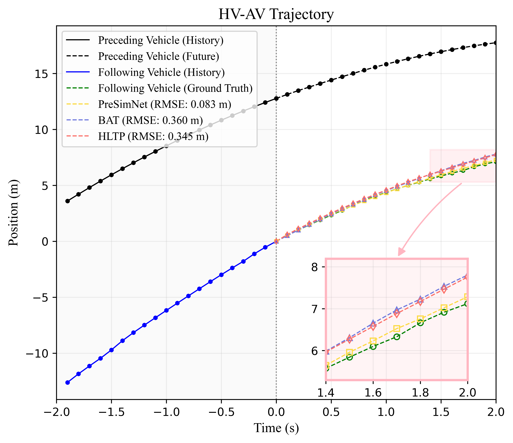
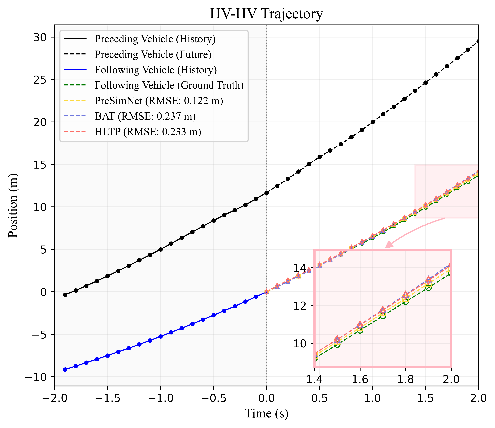

# Article Figures

This folder contains PNG versions of the manuscript figures. PDF figures from the article source folder were converted to PNG so they render directly on GitHub.

## Main Figures

## Prediction Examples

| AV-AV | AV-HV |
|---|---|
|  |  |

| HV-AV | HV-HV |
|---|---|
|  |  |

## Simulation And Prediction Examples

| AV-AV | AV-HV |
|---|---|
|  |  |

| HV-AV | HV-HV |
|---|---|
|  |  |
